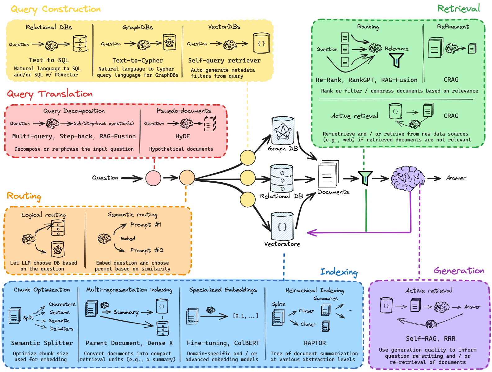

# From Basic to Advanced RAG: Evolving Toward Context-Aware Knowledge Retrieval

The evolution from a basic RAG (Retrieval-Augmented Generation) pipeline to an advanced architecture arises from the necessity to overcome the limitations of simple retrieval and generation workflows. While the canonical pipeline of *indexing → retrieval → generation* serves as a foundation, it often struggles when queries are ambiguous, data scales are large, or domain specificity is required.

Advanced RAG architectures introduce mechanisms that enhance retrieval coverage, improve relevance ranking, and enable contextual reasoning over diverse data sources. The following document presents the **core elements of an end-to-end advanced RAG pipeline**, explaining what each component is, why it matters, how it is implemented, and the relevant evaluation considerations.

---

## End-to-End Advanced RAG Pipeline Elements

### 1. Query Translation

Query translation reformulates the original query into one or more alternative representations to improve retrieval recall and diversity.

#### 1.1 Multi-Query

**Purpose:**
Generate diverse paraphrases that capture different possible interpretations of user intent.

**Implementation:**
Use a lightweight generative model to produce multiple query variants, embed each variant, perform retrieval, and then aggregate results with deduplication.

**Evaluation:**
Measure recall and precision improvements, and compute marginal utility for each additional paraphrase.

---

#### 1.2 RAG Fusion

**Purpose:**
Combine retrieval results from multiple query variants into a unified context for generation.

**Implementation:**
Merge retrieved sets, remove duplicates, and apply relevance-aware aggregation. Optionally use a re-ranking model to prioritize fused results.

**Evaluation:**
Measure end-to-end answer accuracy, contextual coverage, and consistency improvements.

##### 1.2.1 Example Research Context

When handling multi-topic or underspecified queries, RAG Fusion ensures that all relevant perspectives are included in the context before generation. It is particularly effective in long-form answer generation and domain-rich retrieval tasks.

---

#### 1.3 Decomposition

**Purpose:**
Break complex or multi-facet queries into smaller sub-queries, each addressing a distinct component of the overall question.

**Implementation:**
Use task-aware decomposition rules or an LLM-based query splitter. Retrieve results for each sub-query and synthesize the final answer.

**Evaluation:**
Assess improvements in retrieval quality for composite questions and verify correctness during synthesis.

---

#### 1.4 Step-Back Reformulation

**Purpose:**
Iteratively reformulate the query when retrieval or generation confidence is low.

**Implementation:**
Include a failure detector that triggers reformulation. The system generates new query candidates and re-retrieves evidence.

**Evaluation:**
Monitor reduction in failed responses and analyze additional computational cost per iteration.

---

#### 1.5 HyDE (Hypothetical Document Embedding)

**Purpose:**
Generate hypothetical answers to a query and use them as pseudo-queries for document retrieval.

**Implementation:**
Produce candidate answers using a generative model, embed these pseudo-answers, and retrieve supporting documents for validation.

**Evaluation:**
Effective in low-recall environments. Measure improvements in retrieval precision and reduction in hallucinated outputs.

---

### 2. Routing

Routing determines which data source, index, or retrieval strategy to use for a given query.

#### 2.1 Logical Routing

**Purpose:**
Use deterministic rules such as keywords, metadata, or explicit user instructions to select the target corpus.

**Implementation:**
Design rule-based selectors mapping query features to database schemas or indices.

**Evaluation:**
Track routing accuracy and analyze the rate of misrouted queries.

---

#### 2.2 Semantic Routing

**Purpose:**
Select data sources based on semantic similarity rather than explicit rules.

**Implementation:**
Compute query embeddings and compare them to source-level embeddings representing various knowledge domains. Route to the most relevant sources.

**Evaluation:**
Measure relevance gain and monitor latency overhead introduced by multi-source retrieval.

---

### 3. Query Construction

Query construction tailors the query for the target index or database type.

#### 3.1 Text-to-Cypher

**Purpose:**
Convert natural language into Cypher queries for graph databases.

**Implementation:**
Use schema-aware translation with validation against graph patterns.

**Evaluation:**
Evaluate correctness and retrieval precision.

---

#### 3.2 Text-to-SQL

**Purpose:**
Transform natural language questions into SQL queries for structured databases.

**Implementation:**
Use schema constraints and safe query templates to prevent unsafe execution.

**Evaluation:**
Track SQL accuracy, execution safety, and downstream correctness.

---

#### 3.3 Self-Query Retriever

**Purpose:**
Automatically derive effective query terms and filters from a document collection to enhance retrieval.

**Implementation:**
Use a model to generate keywords or metadata filters, then evaluate and refine based on retrieval quality.

**Evaluation:**
Measure performance improvements in structured search tasks.

---

### 4. Indexing

Indexing organizes data for efficient and semantically meaningful retrieval.

#### 4.1 Chunk Optimization

**Purpose:**
Determine the best chunk size and overlap for a specific retrieval context.

**Implementation:**
Employ adaptive chunking based on document structure and validate performance empirically.

**Evaluation:**
Optimize the balance between precision and computational efficiency.

---

#### 4.2 Specialized Embeddings

**Purpose:**
Use domain-specific or task-tuned embedding models.

**Implementation:**
Fine-tune embeddings on domain data or integrate multi-modal encoders.

**Evaluation:**
Compare embedding quality using relevance metrics and downstream generation accuracy.

---

#### 4.3 Multi-Representation Indexing

**Purpose:**
Store multiple representations per document, such as dense, sparse, and hierarchical embeddings.

**Implementation:**
Maintain hybrid indexes and enable retrieval strategies that merge lexical and semantic signals.

**Evaluation:**
Measure recall and precision gains from hybrid retrieval.

---

#### 4.4 Hierarchical Indexing

**Purpose:**
Enable coarse-to-fine retrieval through hierarchical organization.

**Implementation:**
Construct layered indexes: a top-level category index followed by finer sub-indexes.

**Evaluation:**
Assess speed improvements and manage complexity of maintaining multiple levels.

---

### 5. Retrieving

Retrieving involves producing and refining candidate evidence for the generator.

#### 5.1 Ranking

Assign relevance scores to retrieved documents and order them accordingly.

##### 5.1.1 Re-Rank

**Purpose:**
Re-evaluate top retrieved results using cross-encoders or LLMs for improved contextual matching.

**Implementation:**
Score query–document pairs jointly and reorder results by relevance confidence.

**Evaluation:**
Measure NDCG, MRR, and precision-at-k improvements.

##### 5.1.2 RankGPT

**Purpose:**
Employ a generative model to judge or enhance ranking decisions.

**Implementation:**
Generate ranking features or direct relevance scores via an LLM.

**Evaluation:**
Compare ranking consistency and latency with baseline methods.

##### 5.1.3 RAG Fusion

**Purpose:**
Fuse rankings from multiple retrievers into a single, normalized list.

**Implementation:**
Normalize scores and use a learned combiner or heuristic to merge outputs.

**Evaluation:**
Monitor aggregated recall and end-to-end generation quality.

---

#### 5.2 Refinement

##### 5.2.1 CRAG (Context Refinement for RAG)

**Purpose:**
Simplify, compress, or clean retrieved content before feeding it to the generator.

**Implementation:**
Remove redundancy, summarize passages, and extract key sentences to reduce input length while retaining meaning.

**Evaluation:**
Measure generation accuracy and efficiency gains.

---

#### 5.3 Active Retrieval

**Purpose:**
Iteratively fetch new evidence during generation based on detected uncertainty or missing information.

**Implementation:**
Allow the generator to issue “context requests” dynamically for clarification.

**Evaluation:**
Analyze trade-offs between latency and answer completeness.

---

### 6. Generation

Generation synthesizes the final answer using retrieved evidence.

#### 6.1 Self-RAG

**Purpose:**
Enable the model to critique and refine its own output by re-invoking retrieval based on self-analysis.

**Implementation:**
Perform a two-stage process: initial draft → critique → retrieval → refined response.

**Evaluation:**
Measure reduction in factual errors and improvement in justification coverage.

---

#### 6.2 RRR (Retrieve, Re-Rank, Refine)

**Purpose:**
Iteratively improve generated responses by repeated retrieval and evaluation cycles.

**Implementation:**
Set up an iterative loop with thresholds to determine when refinement should stop.

**Evaluation:**
Track performance improvement per iteration and measure compute overhead.

Below is the final, structured continuation you can append at the end of your document:

---

### End-to-End Advanced RAG Architecture

Below is the visual representation of the **End-to-End Advanced RAG Architecture**, which will be implemented from scratch in the upcoming notebooks.
This architecture illustrates the complete data and control flow, starting from **query translation and routing**, through **retrieval refinement and ranking**, and culminating in **generation and self-evaluation**.
Each component contributes to improving **contextual understanding**, **retrieval precision**, and **generation reliability**, forming a cohesive, production-ready RAG ecosystem.

